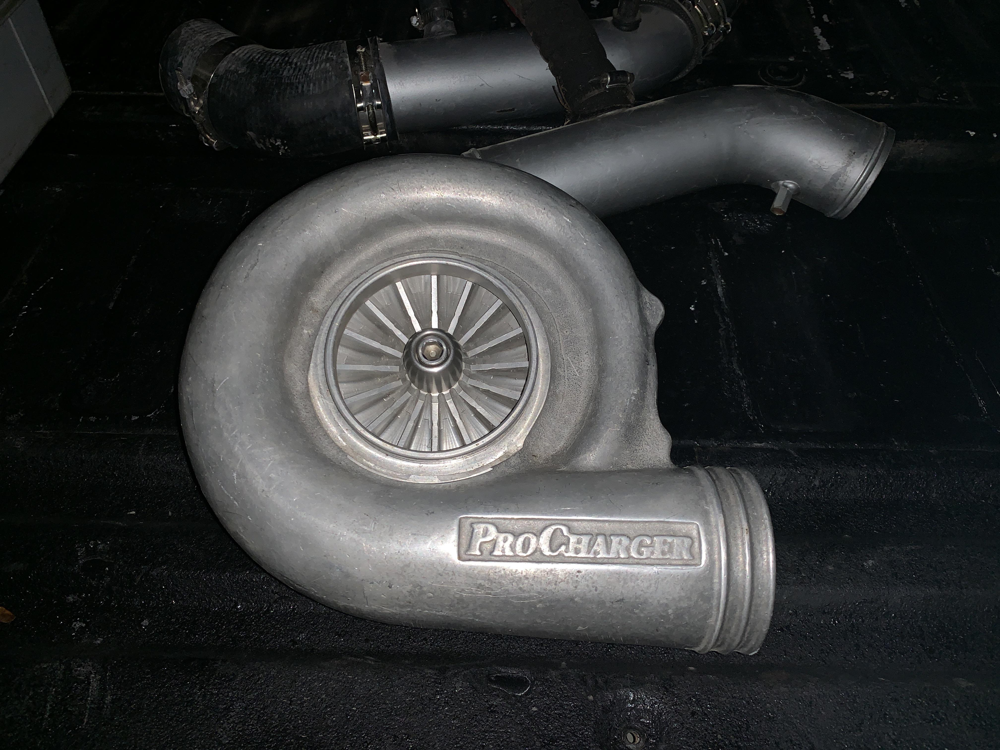

# screp

"_That's nice honey._"

## You'll need a

- A chromewebdriver - you can get [here](https://chromedriver.chromium.org/downloads). Extract into this directory, and ensure the path is correct on [line 18](https://github.com/GerardWalsh/screp/blob/cfab40d4e2968084c3e42c37c946bb3708034d20/screp.py#L11).

## TODO

- Oh boi
